<!-- Documentação tecnica do projeto -->
1. Definição do Tema
O Sistema de Manutenção Preventiva e Corretiva é um software destinado ao gerenciamento do ciclo de vida de máquinas e equipamentos industriais, com foco em minimizar o tempo de inatividade e otimizar a performance operacional. Ele permite o controle das manutenções preventivas (realizadas regularmente para evitar falhas) e corretivas (realizadas após uma falha). O sistema também inclui funcionalidades para registrar falhas, gerenciar técnicos, gerar relatórios e acompanhar indicadores de desempenho, como o MTTR (Mean Time to Repair - Tempo Médio de Reparo) e o MTBF (Mean Time Between Failures - Tempo Médio Entre Falhas).

2. Análise de Requisitos e Escopo

**Funcionalidades Principais:**
    Gerenciamento de Máquinas e Equipamentos:
Cadastro de máquinas, incluindo especificações técnicas, data de aquisição e localização.
Visualização e edição de informações de máquinas.
    Registro e Controle de Manutenções:
Registro de manutenções preventivas e corretivas.
Histórico completo de manutenções para cada máquina.
Registro de peças substituídas e tempo de inatividade.
    Gerenciamento de Falhas:
Registro de falhas ocorridas, classificando a severidade e identificando o operador.
Controle de falhas por máquina.
    Gerenciamento de Técnicos:
Cadastro de técnicos, incluindo suas especialidades e disponibilidade.
    Relatórios e Indicadores:
Geração de relatórios de manutenção, tempo de inatividade, falhas e peças trocadas.
Cálculo de indicadores como MTTR e MTBF.
    Integração com API:
Utilização de uma API REST (JSON-Server) para armazenar e recuperar dados.

**Requisitos Funcionais:**
O sistema deve permitir o cadastro de máquinas com suas especificações.
O sistema deve registrar manutenções preventivas e corretivas, associando técnicos e peças trocadas.
O sistema deve gerar relatórios de manutenção e indicadores de performance.
O sistema deve oferecer uma interface gráfica intuitiva para o usuário final.

**Requisitos Não Funcionais:**
O sistema deve ser responsivo, com tempo de resposta rápido ao realizar operações com a API.
A interface deve ser amigável e permitir fácil navegação entre as funcionalidades.
O sistema deve armazenar e recuperar dados de maneira segura e eficiente.

ESCOPO DO PROEJETO

# Escopo do Sistema de Manutenção Preventiva e Corretiva

## Objetivos:
- **Minimizar o Tempo de Inatividade**: Desenvolver um sistema em Java que reduza o tempo em que máquinas e equipamentos ficam fora de operação.
- **Otimizar a Performance Operacional**: Melhorar a eficiência e a produtividade por meio do gerenciamento eficaz das manutenções.
- **Gerenciamento de Manutenções**: Controlar e programar manutenções preventivas e corretivas de forma sistemática utilizando as funcionalidades do Java.
- **Registro de Falhas**: Criar um banco de dados para registrar falhas e intervenções, facilitando o acompanhamento histórico.
- **Gestão de Técnicos**: Monitorar a disponibilidade e o desempenho dos técnicos responsáveis pela manutenção.
- **Geração de Relatórios**: Fornecer relatórios detalhados sobre manutenções realizadas, falhas ocorridas e indicadores de desempenho.
- **Acompanhamento de Indicadores**: Monitorar o MTTR e MTBF para análise contínua e melhoria dos processos.

## Levantamento de Recursos:
- **Recursos Humanos**:
  - Desenvolvedor interno
  - **Infraestrutura Tecnológica**:
  - Servidores para hospedagem do software, com suporte a aplicações Java.
  - Equipamentos de rede para garantir conectividade.
  - Dispositivos de acesso (computadores, tablets, etc.) para os usuários.
- **Software**:
  - IDEs (Ambientes de Desenvolvimento Integrado) como IntelliJ IDEA ou Eclipse para desenvolvimento em Java.
  - Ferramentas de gerenciamento de banco de dados (como MySQL ou PostgreSQL) para armazenamento das informações.
  - Bibliotecas Java para geração de relatórios e análise de dados.
- **Treinamento**:
  - Capacitação da equipe para o uso eficiente do sistema desenvolvido em Java.
  - Workshops e materiais de apoio para a adoção das melhores práticas.

## Análise de Riscos:
- **Falhas Técnicas**: Risco de instabilidade do software ou falhas no servidor que podem impactar o acesso ao sistema.
  - **Mitigação**: Implementar um plano de backup e recuperação de dados, utilizando ferramentas compatíveis com Java.

- **Resistência à Mudança**: Funcionários podem resistir à adoção do novo sistema.
  - **Mitigação**: Realizar treinamentos e mostrar benefícios práticos do sistema.

- **Falta de Dados Precisos**: Dados imprecisos ou incompletos podem comprometer a eficácia do sistema.
  - **Mitigação**: Estabelecer padrões de registro e auditorias regulares para garantir a qualidade dos dados.

- **Sobrecarga de Trabalho**: A implementação do sistema pode demandar mais tempo da equipe durante a fase inicial.
  - **Mitigação**: Planejar uma fase de transição gradual e alocar recursos adequados para suporte.

- **Custos de Manutenção**: Possíveis custos adicionais com manutenção do software.
  - **Mitigação**: Planejar um orçamento adequado e considerar soluções de software escaláveis e sustentáveis.

Crie um diagrama de classes

cadastrar um tecnico

cadastrar uma falha

cadastrar uma máquina

Testando ApiREST
MÁQUINAS
POST
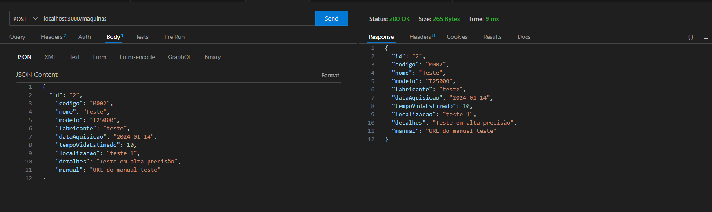

GET
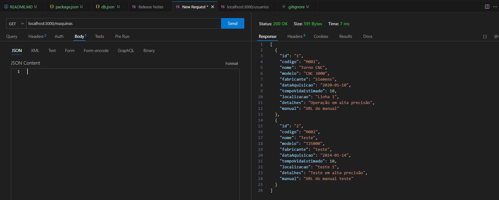

PUT
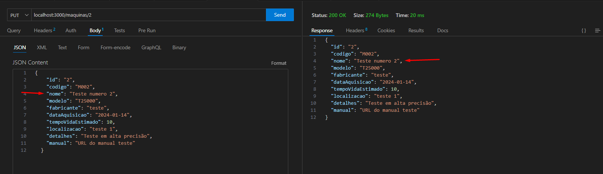

DELETE
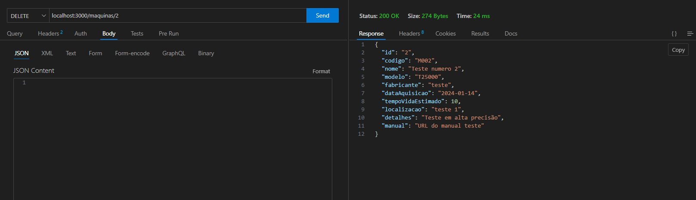
CONFIRMAÇÃO DELETE
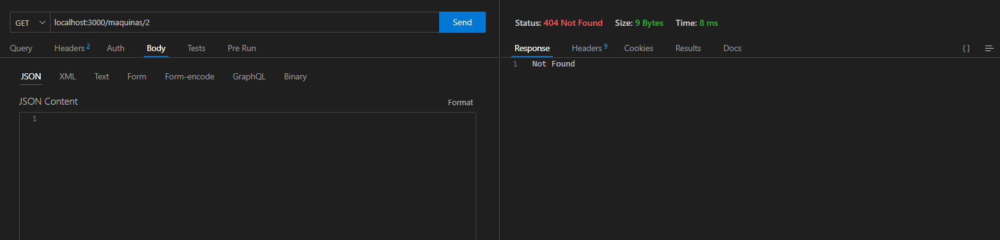

HISTÓRICO DE MANUTENÇÃO
POST
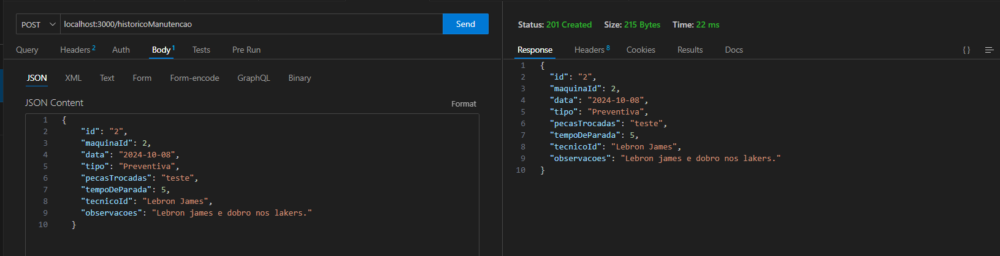

GET
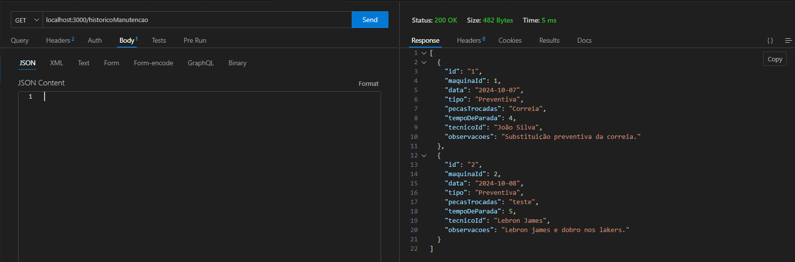

FALHAS
POST
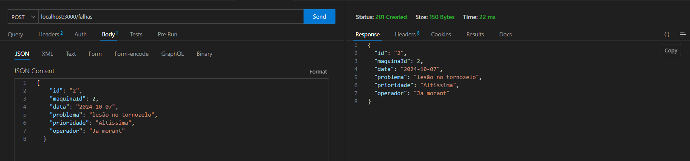

GET
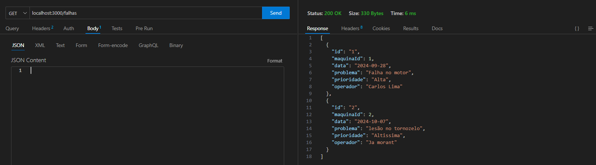

TÉCNICOS
POST
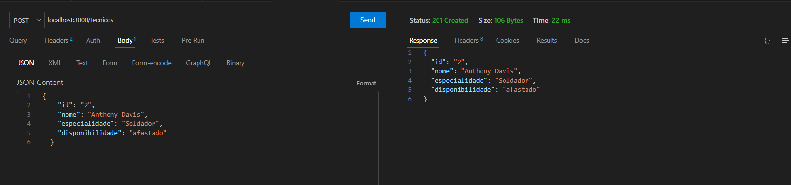

GET
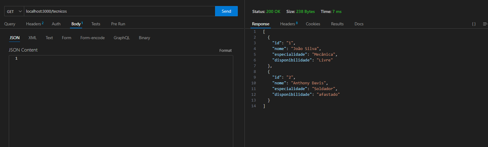

DELETE
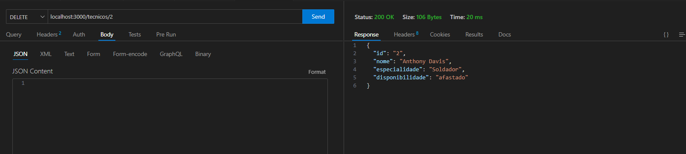
CONFIRMAÇÃO DELETE
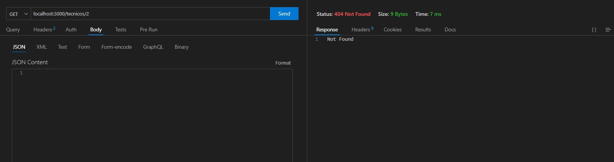